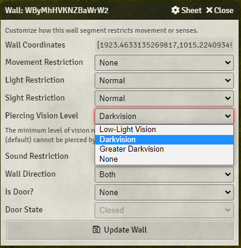
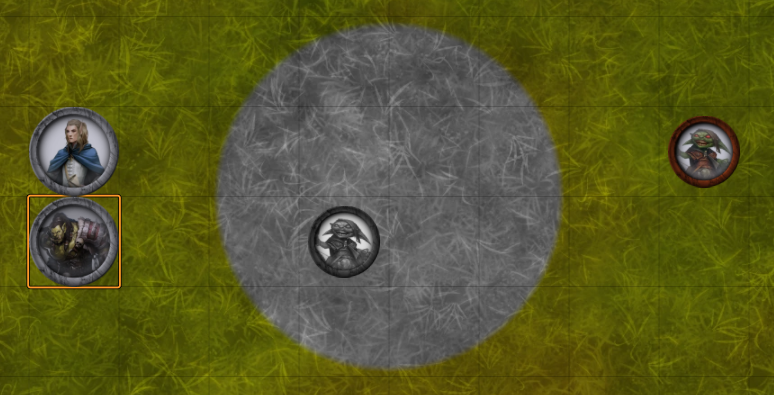
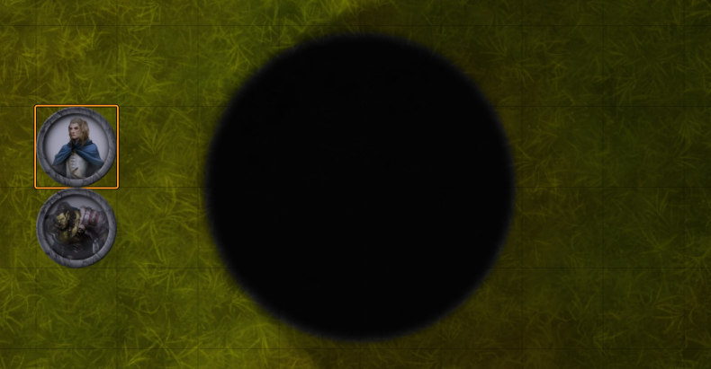

# Sense Walls (Multisystem)

 

 

Invisible Stalkers should only be seen by players that have cast See Invisibility.  Stealthy Goblins should only be seen by players with high perception.
And when that Drow casts Darkness, players should need Devil's Sight to see any tokens inside.

Conditional Visibility allows you to set conditions on tokens that will display them only to players whose senses meet the conditions necessary to see
the token.

## Suggestion for future developing for anyone want to help

- A integration with the 'levels' module it's seem to be the right road to follow, we can use the method `overrideVisibilityTets(sourceToken, token){}` of levels for override the levels visibility test
- Sync the status with the flags on the token
- With the advent of foundry version 9 it could be done much better by synchronizing it with modules like levels and Active Token Effect.

## Installation

It's always easiest to install modules from the in game add-on browser.

To install this module manually:
1.  Inside the Foundry "Configuration and Setup" screen, click "Add-on Modules"
2.  Click "Install Module"
3.  In the "Manifest URL" field, paste the following url:
`https://raw.githubusercontent.com/p4535992/fvtt-sense-walls-multisystem/master/src/module.json`
4.  Click 'Install' and wait for installation to complete
5.  Don't forget to enable the module in game using the "Manage Module" button

### libWrapper

This module uses the [libWrapper](https://github.com/ruipin/fvtt-lib-wrapper) library for wrapping core methods. It is a hard dependency and it is recommended for the best experience and compatibility with other modules.

### socketlib

This module uses the [socketlib](https://github.com/manuelVo/foundryvtt-socketlib) library for wrapping core methods. It is a hard dependency and it is recommended for the best experience and compatibility with other modules.

### perfect-vision (optional but suggested)

This module uses the [Perfect Vision](https://foundryvtt.com/packages/perfect-vision) library. It is a optional but suggested dependency and it is recommended for the best experience and compatibility with other modules.

## Supported Systems

- [Pathfinder 2e](https://foundryvtt.com/packages/pf2e)

## Features

Walls can be configured to only block up to a certain level of vision. For example, if the "Piercing Vision Level" is set to "Dakvision" then a character with darkvision or greater darkvision can see through the wall, but one with only low-light vision cannot.

This can be used to set up an area created by the [Darkness](https://2e.aonprd.com/Spells.aspx?ID=59) spell, which blocks light from the other side.

### Wall Configuration

### With Darkvision

### With Normal Vision

The setup above also uses the [Perfect Vision](https://foundryvtt.com/packages/perfect-vision) module to create an area of darkness, which is surrounded with walls using the config above.

<i>Perfect Vision</i> produces the greyscale effect inside the circle for the orc. Without <i>Sense Walls</i>, the area and goblin warrior on the other side of the darkness would be visible to the human.

## [Changelog](./CHANGELOG.md)

## Issues

Any issues, bugs, or feature requests are always welcome to be reported directly to the [Issue Tracker](https://github.com/p4535992/sense-walls-multisystem/issues ), or using the [Bug Reporter Module](https://foundryvtt.com/packages/bug-reporter/).

## License

This package is under an [MIT license](LICENSE) and the [Foundry Virtual Tabletop Limited License Agreement for module development](https://foundryvtt.com/article/license/).

## Credit

