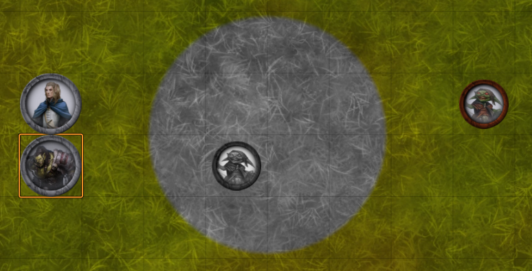

# FVTT Sense Walls
A module for Foundry VTT that allows walls to block only certain senses, while other senses can "pierce" the wall.

Recommended for use with [PF2e Rules Based NPC Vision](https://github.com/JDCalvert/FVTT-PF2e-Rules-Based-NPC-Vision).

## Supported Systems
- [Pathfinder 2e](https://foundryvtt.com/packages/pf2e)

## Features
Walls can be configured to only block up to a certain level of vision. For example, if the "Piercing Vision Level" is set to "Dakvision" then a character with darkvision or greater darkvision can see through the wall, but one with only low-light vision cannot.

This can be used to set up an area created by the [Darkness](https://2e.aonprd.com/Spells.aspx?ID=59) spell, which blocks light from the other side.

### Wall Configuration

### With Darkvision

### With Normal Vision

### Setup
The setup above also uses the [Perfect Vision](https://foundryvtt.com/packages/perfect-vision) module to create an area of darkness, which is surrounded with walls using the config above.

<i>Perfect Vision</i> produces the greyscale effect inside the circle for the orc. Without <i>Sense Walls</i>, the area and goblin warrior on the other side of the darkness would be visible to the human.

## Requirements
- [libWrapper](https://foundryvtt.com/packages/lib-wrapper)
